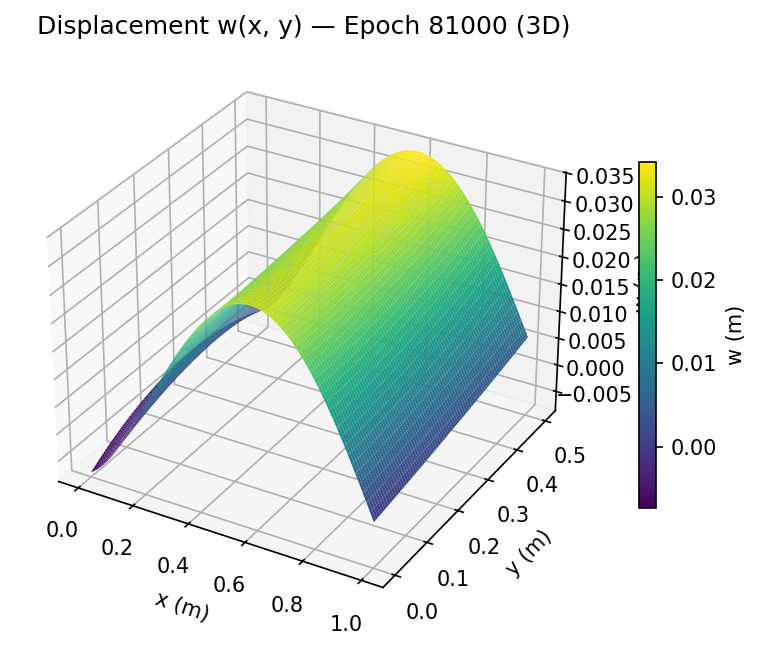

# PINN-CLT: Physics-Informed Neural Network for Classical Lamination Theory

[](https://github.com/eljandoubi/PINN_CLT/actions/workflows/ci.yml)
[](LICENSE)
[](https://www.python.org/downloads/)
[](https://github.com/astral-sh/uv)
[](https://github.com/astral-sh/ruff)

A Physics-Informed Neural Network (PINN) for solving the orthotropic plate bending problem governed by Classical Lamination Theory (CLT).

The network learns the transverse displacement field `w(x, y)` by minimizing the residual of the governing PDE:
```
D11·∂⁴w/∂x⁴ + 2(D12 + 2·D66)·∂⁴w/∂x²∂y² + D22·∂⁴w/∂y⁴ = q
```

## My Solution


## Table of Contents

- [Features](#features)
- [Project Structure](#project-structure)
- [Installation](#installation)
- [Usage](#usage)
- [Configuration](#configuration)
- [Boundary Conditions](#boundary-conditions)
- [Material Properties](#material-properties-t3005208-carbon-fiber)
- [Development](#development)
- [Contributing](#contributing)
- [License](#license)

## Features

- **Orthotropic material model** — T300/5208 carbon fiber with full [Q] and [D] stiffness matrices
- **Residual blocks** — optional ResNet-style MLP with LayerNorm for stable training
- **Adaptive loss weighting** — learnable task weights via homoscedastic uncertainty (Kendall et al., 2018)
- **Multiple loss functions** — MSE, Huber, Reverse Huber, and L1
- **Smooth activation functions** — All activations are C∞ (infinitely differentiable), suitable for 4th-order PDE: `tanh`, `silu`, `gelu`, `softplus`, `mish`, `sigmoid`, `logsigmoid`, `tanhshrink`, `gaussian` (exp(−x²)), `sin`, `cos`
- **Automatic differentiation** — 4th-order derivatives computed via PyTorch autograd
- **Mini-batch collocation** — fresh random domain points resampled each epoch
- **Checkpointing & resume** — save/load full training state; best model tracked by averaged physics loss
- **Early stopping** — configurable patience-based stopping on averaged physics loss
- **L-BFGS fine-tuning** — optional switch to L-BFGS optimizer after Adam warmup for sharper convergence
- **Optimizer state reset** — clears Adam/L-BFGS momentum for adaptive weight params on periodic reset
- **W&B logging** — losses, learning rate, 3D displacement plots, training video, and model artifact upload
- **CLI configuration** — all hyperparameters configurable via `simple-parsing`
- **Fully tested** — 160+ pytest cases (unit + end-to-end training smoke tests) with >90% coverage, enforced in CI

## Project Structure

```
├── data.py             # Material properties, geometry, boundary data generation
├── model.py            # PINN architecture (network, residual blocks, adaptive weights)
├── losses.py           # PDE residual, boundary/natural BC losses, gradient clipping
├── train.py            # Training loop with checkpointing, early stopping, W&B
├── checkpoint.py       # Save/load checkpoint utilities
├── early_stopping.py   # Early stopping class
├── plotting.py         # 3D displacement field w(x,y) visualization
├── video.py            # Generate MP4/GIF video from plot frames
├── tests/              # Test suite (pytest)
│   ├── conftest.py          # Shared fixtures (headless plotting, offline W&B)
│   ├── test_checkpoint.py
│   ├── test_data.py
│   ├── test_early_stopping.py
│   ├── test_integration.py  # End-to-end training smoke tests
│   ├── test_losses.py
│   ├── test_model.py
│   ├── test_plotting.py
│   ├── test_train.py
│   └── test_video.py
├── .github/workflows/  # CI (lint + format + test on every push/PR)
├── justfile            # Convenience commands (`just test`, `just lint`, ...)
├── pyproject.toml      # Project metadata & dependencies (managed by uv)
└── LICENSE             # Apache 2.0
```

## Installation

```bash
# Clone the repository
git clone https://github.com/eljandoubi/PINN_CLT.git && cd PINN_CLT

# Install dependencies (requires uv)
uv sync
```

### System FFmpeg (optional, for MP4 video export)

`imageio-ffmpeg` bundles its own ffmpeg binary. If you prefer system ffmpeg or encounter issues:

<details>
<summary>Platform-specific install instructions</summary>

**macOS (Homebrew):**
```bash
brew install ffmpeg
```

**Ubuntu / Debian:**
```bash
sudo apt update && sudo apt install ffmpeg
```

**Fedora / RHEL:**
```bash
sudo dnf install ffmpeg
```

**Windows (winget):**
```powershell
winget install FFmpeg
```
</details>

## Usage

### Train from scratch

```bash
uv run train.py
```

### Custom hyperparameters

```bash
uv run train.py --epochs 50000 --learning_rate 5e-4 --batch_size 4096 --patience 20
```

### With residual blocks and LayerNorm

```bash
uv run train.py --use_residual true --use_norm true --hidden_layers 6 --hidden_units 128
```

### With adaptive loss weighting

```bash
uv run train.py --adaptive_weights true --lambda_physics 10.0 --lambda_boundary 1.0 --lambda_natural 1.0
```

### With L-BFGS after Adam warmup

```bash
uv run train.py --use_lbfgs true --lbfgs_warmup 10000 --lbfgs_lr 1.0
```

### Resume from checkpoint

```bash
uv run train.py --resume runs/<run_id>/checkpoints/best.pt --run_id <run_id>
```

### Generate video from existing plots

```bash
uv run video.py
```

### Run tests

```bash
uv run pytest
# or, with the justfile:
just test
```

### All available options

```bash
uv run train.py --help
```

## Configuration

| Parameter | Default | Description |
|-----------|---------|-------------|
| `hidden_layers` | 4 | Number of hidden layers / residual blocks |
| `hidden_units` | 128 | Neurons per hidden layer |
| `activation` | `tanh` | Activation function (`tanh`, `silu`, `gelu`, `softplus`, `mish`, `sigmoid`, `logsigmoid`, `tanhshrink`, `gaussian`, `sin`, `cos`) |
| `loss_fn` | `mse` | Loss function (`mse`, `huber`, `reverse_huber`, `l1`) |
| `learning_rate` | 1e-3 | Adam learning rate |
| `max_grad_norm` | 1.0 | Maximum gradient norm for clipping |
| `epochs` | 100000 | Maximum training epochs |
| `batch_size` | 4096 | Collocation points per epoch |
| `lambda_physics` | 1.0 | PDE loss weight |
| `lambda_boundary` | 1.0 | Boundary condition loss weight |
| `lambda_natural` | 1.0 | Natural BC loss weight (Mx, My, Vy) |
| `scheduler_step` | 10000 | LR decay step interval |
| `scheduler_gamma` | 0.5 | LR decay factor |
| `patience` | 10 | Early stopping patience (checked every `log_every` epochs) |
| `log_every` | 1000 | Logging frequency (epochs) |
| `checkpoint_every` | 1000 | Checkpoint & plot frequency (epochs) |
| `use_residual` | `false` | Use ResNet-like residual blocks |
| `use_norm` | `false` | Apply LayerNorm inside residual blocks |
| `use_ffmlp` | `false` | Use gated feed-forward MLP blocks (transformer-style) |
| `normalize` | `false` | Normalize PDE/natural BC losses by D11 for stability |
| `adaptive_weights` | `false` | Learnable adaptive loss weighting (Kendall et al.) |
| `use_lbfgs` | `false` | Switch to L-BFGS optimizer after Adam warmup |
| `lbfgs_warmup` | 10000 | Number of Adam epochs before switching to L-BFGS |
| `lbfgs_max_iter` | 20 | Max iterations per L-BFGS step |
| `lbfgs_history_size` | 50 | L-BFGS history size |
| `lbfgs_lr` | 1.0 | L-BFGS learning rate |
| `reset_period` | `None` | Reset adaptive weights every N epochs (must be multiple of `log_every`) |
| `runs_dir` | `runs` | Base directory for all run outputs |
| `run_id` | `None` | W&B run ID (auto-generated if omitted) |
| `resume` | `""` | Path to checkpoint for resuming |

## Boundary Conditions

| Edge | Type | Conditions |
|------|------|------------|
| x = 0 | Fixed (clamped) | w = 0, ∂w/∂x = 0 |
| x = L | Simply supported | w = 0, Mx = 0 |
| y = 0 | Free | My = 0, Vy = 0 |
| y = W | Free | My = 0, Vy = 0 |

## Material Properties (T300/5208 Carbon Fiber)

| Property | Value |
|----------|-------|
| E₁ | 181 GPa |
| E₂ | 10.3 GPa |
| G₁₂ | 7.17 GPa |
| ν₁₂ | 0.28 |
| Thickness h | 5 mm |
| Plate L × W | 1.0 m × 0.5 m |
| Pressure q | 10 kPa |

## Development

This project uses [uv](https://github.com/astral-sh/uv) for dependency management and [ruff](https://github.com/astral-sh/ruff) for linting/formatting. A [`justfile`](justfile) wraps the common commands:

```bash
just install       # uv sync --locked (main deps + dev tools)
just test          # run the full test suite (unit + slow smoke tests)
just test-fast     # run only the fast unit tests
just cov           # run tests with terminal + HTML coverage report
just lint          # ruff check
just fix           # ruff check --fix
just format        # ruff format
just format-check  # ruff format --check (no changes; used in CI)
just check         # lint + format-check + cov (what CI runs)
just train         # uv run train.py (extra args are forwarded, e.g. `just train --epochs 5000`)
just video         # uv run video.py
just clean         # remove caches, coverage, runs/, wandb/, checkpoints/, plots/
```

Don't have [`just`](https://github.com/casey/just) installed? Every recipe is a thin wrapper around a `uv run ...` command — see the [justfile](justfile) and run the equivalent command directly.

### Testing

The test suite (`tests/`) covers material/geometry data, model architecture, loss/PDE-residual math, checkpointing, early stopping, plotting, video generation, CLI config validation, and full end-to-end training runs (offline W&B, tiny models) — over 160 tests at >90% coverage.

Slow, end-to-end tests are marked `@pytest.mark.slow`; skip them for a fast inner-loop with `just test-fast` or `uv run pytest -m "not slow"`.

### Continuous Integration

Every push and pull request to `main` runs [`.github/workflows/ci.yml`](.github/workflows/ci.yml): `ruff check`, `ruff format --check`, and the full test suite with a coverage gate (fails below 90%).

## Contributing

1. Fork and clone the repo, then run `uv sync` (or `just install`).
2. Make your changes, adding/updating tests as needed.
3. Run `just check` locally (mirrors CI) before opening a PR.
4. Open a pull request describing the change and its motivation.

## License

Apache 2.0 — see [LICENSE](LICENSE).
